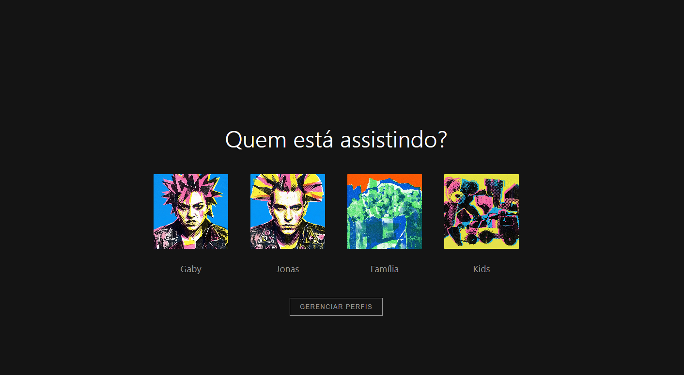

# Netflix Clone - Projeto Frontend

Um clone interativo da interface da Netflix desenvolvido com **HTML**, **CSS** e **JavaScript Vanilla**.  
Projeto criado durante a **Imersão Frontend com IA da Alura**, com foco em aprendizado prático de desenvolvimento frontend, componentização e organização de código.

---

## Preview



---

## 🔗 Demo

Acesse o projeto online:  
https://jneres00.github.io/Clone-Netflix/
---


## 🎯 Funcionalidades

- ✅ Seleção de perfis
- ✅ Catálogo dinâmico organizado em categorias
- ✅ Preview automático de trailers ao passar o mouse
- ✅ Controle de som dos vídeos
- ✅ Barra de progresso para conteúdos assistidos
- ✅ Layout responsivo para desktop, tablet e mobile
- ✅ Interface inspirada na Netflix

---

## 💻 Tecnologias Utilizadas

- HTML5
- CSS3
- JavaScript ES6+
- YouTube Iframe API
- Font Awesome
- Google Fonts

---


## 📁 Estrutura do Projeto

```txt
TELA NETFLIX/
│
├── index.html
├── style.css
│
├── catalogo/
│   ├── catalogo.html
│   ├── catalogo.css
│   └── js/
│       ├── main.js
│       ├── data.js
│       ├── utils.js
│       └── components/
│           ├── Card.js
│           └── Carousel.js
│
├── js/
│   └── index.js
│
└── assets/
```

## 🚀 Como Executar

1. Clone o repositório:

```bash
git clone https://github.com/jneres00/Clone-Netflix.git
```

2. Abra o projeto no VS Code.

3. Execute com uma extensão como Live Server  
ou abra o `index.html` diretamente no navegador.

---

## 📱 Responsividade

O projeto foi otimizado para diferentes tamanhos de tela:

| Dispositivo | Breakpoint |
|-------------|------------|
| Desktop     | > 1024px   |
| Tablet      | 768px–1024px |
| Mobile      | < 768px    |

---

## 🔧 Funcionalidades Técnicas

### Card.js

Responsável pelos cards individuais de filmes e séries:

- Renderização dos conteúdos
- Reprodução de trailers
- Controle de hover
- Barra de progresso

### Carousel.js

Cria os carrosséis organizados por categoria.

### utils.js

Contém funções auxiliares, como a extração de IDs do YouTube.

### localStorage

O projeto utiliza `localStorage` para armazenar:

- Perfil selecionado
- Imagem do perfil

---

## ⚡ Boas Práticas Utilizadas

- Modularização com ES6 Modules
- Componentização
- Responsividade mobile-first
- Organização de arquivos
- Nomenclatura semântica
- Performance otimizada
- Acessibilidade básica

---


## 📝 Aprendizados

Durante o desenvolvimento deste projeto foram praticados conceitos como:

- Manipulação do DOM
- Modularização
- Componentes reutilizáveis
- Responsividade
- Integração com APIs
- Armazenamento local com `localStorage`

Além disso, o projeto também serviu como experiência prática no uso de ferramentas de IA aplicadas ao desenvolvimento frontend.

---

## 📄 Licença

Projeto desenvolvido apenas para fins educacionais.
Não possui afiliação com Netflix, Inc.

---

## 👩‍💻 Autor

Desenvolvido por Jéssica Neres durante a Imersão Frontend com IA da Alura, utilizando ferramentas de IA como apoio no aprendizado, organização e melhoria do código.

---

**Status:** ✅ Concluído

**Última atualização:** Maio 2026
